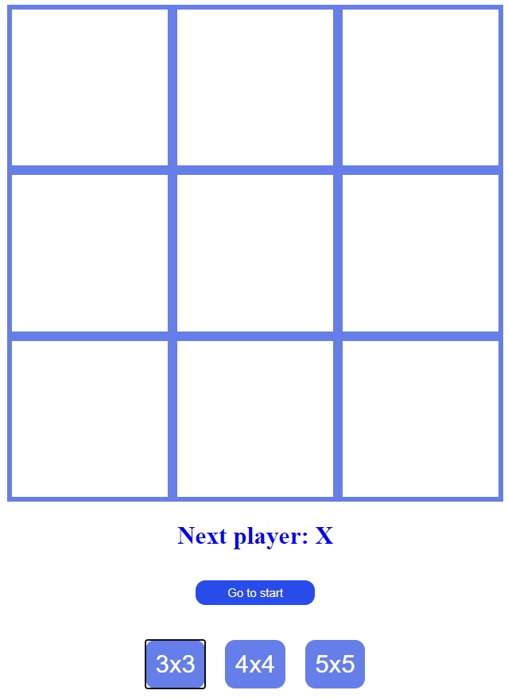

# Second exercise for Software Testing module

&nbsp;

    

&nbsp;
&nbsp;

## This app was written in non-test-driven-development way, it will be refactored to match TDD criteria.

&nbsp;
#### Requirements:

1. The game has to announce the winner - "X" or "O" - or a draw. Test cases (unit tests) must be written for this game logic. (3 points)
2. It must be possible to dynamically select the size of the game grid (3x3, 4x4, 5x5). Test cases (unit tests) must be written for this game logic. (3 points)
3. The winner is announced if 3 "X" or 3 "O" in a row are collected, regardless of the size of the board. Test cases are written for game logic (unit tests). (2 points)
